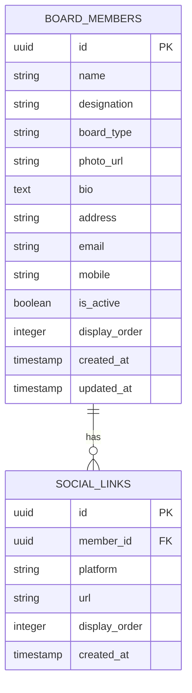

## 1. Architecture design

```mermaid
graph TD
  A[User Browser] --> B[React Frontend Application]
  B --> C[Supabase SDK]
  C --> D[Supabase Service]
  
  subgraph "Frontend Layer"
    B
    E[About Us Page Component]
    F[Leadership Section Component]
    G[Member Profile Modal]
    H[Admin Leadership Manager]
    I[Member Form Component]
  end
  
  subgraph "Service Layer (Provided by Supabase)"
    D
    J[Authentication]
    K[Database (PostgreSQL)]
    L[Storage (File Upload)]
  end
```

## 2. Technology Description

* Frontend: React\@18 + TypeScript + Tailwind CSS + Vite

* Backend: Supabase (Authentication, Database, Storage)

* UI Components: Existing component library + custom modal components

* Rich Text Editor: React-based editor for member bio content

* File Upload: Supabase Storage for member photos

## 3. Route definitions

| Route                            | Purpose                                                                 |
| -------------------------------- | ----------------------------------------------------------------------- |
| /about                           | About Us page with enhanced leadership section displaying board members |
| /admin/about/leadership          | Admin interface for managing board members with CRUD operations         |
| /admin/about/leadership/add      | Form for adding new board members                                       |
| /admin/about/leadership/edit/:id | Form for editing existing board members                                 |

## 4. API definitions

### 4.1 Core API

Board Members Management

```
GET /api/board-members
```

Response:

| Param Name     | Param Type | Description                                  |
| -------------- | ---------- | -------------------------------------------- |
| id             | string     | Unique member identifier                     |
| name           | string     | Member full name                             |
| designation    | string     | Member position/title                        |
| board\_type    | string     | 'governing\_board' or 'board\_of\_directors' |
| photo\_url     | string     | URL to member photo                          |
| bio            | string     | Member biography (rich text)                 |
| address        | string     | Member address                               |
| email          | string     | Member email                                 |
| mobile         | string     | Member mobile number                         |
| social\_links  | array      | Array of social media links                  |
| is\_active     | boolean    | Member visibility status                     |
| display\_order | number     | Sort order for display                       |

```
POST /api/board-members
```

Request:

| Param Name    | Param Type | isRequired | Description                                  |
| ------------- | ---------- | ---------- | -------------------------------------------- |
| name          | string     | true       | Member full name                             |
| designation   | string     | true       | Member position/title                        |
| board\_type   | string     | true       | 'governing\_board' or 'board\_of\_directors' |
| photo         | file       | false      | Member photo upload                          |
| bio           | string     | false      | Member biography                             |
| address       | string     | false      | Member address                               |
| email         | string     | false      | Member email                                 |
| mobile        | string     | false      | Member mobile number                         |
| social\_links | array      | false      | Social media links                           |

Social Media Links

```
POST /api/board-members/:id/social-links
```

Request:

| Param Name | Param Type | isRequired | Description                                         |
| ---------- | ---------- | ---------- | --------------------------------------------------- |
| platform   | string     | true       | Social media platform (linkedin, twitter, facebook) |
| url        | string     | true       | Profile URL                                         |

## 5. Data model

### 5.1 Data model definition



### 5.2 Data Definition Language

Board Members Table (board\_members)

```sql
-- Create board_members table
CREATE TABLE board_members (
  id UUID PRIMARY KEY DEFAULT gen_random_uuid(),
  name VARCHAR(255) NOT NULL,
  designation VARCHAR(255) NOT NULL,
  board_type VARCHAR(50) NOT NULL CHECK (board_type IN ('governing_board', 'board_of_directors')),
  photo_url TEXT,
  bio TEXT,
  address TEXT,
  email VARCHAR(255),
  mobile VARCHAR(20),
  is_active BOOLEAN DEFAULT true,
  display_order INTEGER DEFAULT 0,
  created_at TIMESTAMP WITH TIME ZONE DEFAULT NOW(),
  updated_at TIMESTAMP WITH TIME ZONE DEFAULT NOW()
);

-- Create social_links table
CREATE TABLE social_links (
  id UUID PRIMARY KEY DEFAULT gen_random_uuid(),
  member_id UUID NOT NULL,
  platform VARCHAR(50) NOT NULL CHECK (platform IN ('linkedin', 'twitter', 'facebook', 'instagram')),
  url TEXT NOT NULL,
  display_order INTEGER DEFAULT 0,
  created_at TIMESTAMP WITH TIME ZONE DEFAULT NOW(),
  FOREIGN KEY (member_id) REFERENCES board_members(id) ON DELETE CASCADE
);

-- Create indexes
CREATE INDEX idx_board_members_board_type ON board_members(board_type);
CREATE INDEX idx_board_members_is_active ON board_members(is_active);
CREATE INDEX idx_board_members_display_order ON board_members(display_order);
CREATE INDEX idx_social_links_member_id ON social_links(member_id);

-- Set up RLS policies
ALTER TABLE board_members ENABLE ROW LEVEL SECURITY;
ALTER TABLE social_links ENABLE ROW LEVEL SECURITY;

-- Allow public read access for active members
CREATE POLICY "Public can view active board members" ON board_members
  FOR SELECT USING (is_active = true);

CREATE POLICY "Public can view social links" ON social_links
  FOR SELECT USING (true);

-- Allow authenticated users (admins) full access
CREATE POLICY "Authenticated users can manage board members" ON board_members
  FOR ALL USING (auth.role() = 'authenticated');

CREATE POLICY "Authenticated users can manage social links" ON social_links
  FOR ALL USING (auth.role() = 'authenticated');

-- Grant permissions
GRANT SELECT ON board_members TO anon;
GRANT SELECT ON social_links TO anon;
GRANT ALL PRIVILEGES ON board_members TO authenticated;
GRANT ALL PRIVILEGES ON social_links TO authenticated;

-- Insert sample data
INSERT INTO board_members (name, designation, board_type, bio, email, is_active, display_order) VALUES
('Dr. John Smith', 'Chairman', 'governing_board', 'Experienced educator with 20+ years in academic leadership.', 'chairman@school.edu', true, 1),
('Ms. Sarah Johnson', 'Vice Chairman', 'governing_board', 'Former principal with expertise in curriculum development.', 'vice.chairman@school.edu', true, 2),
('Mr. Michael Brown', 'Director of Operations', 'board_of_directors', 'Business leader with focus on educational excellence.', 'operations@school.edu', true, 1);
```

