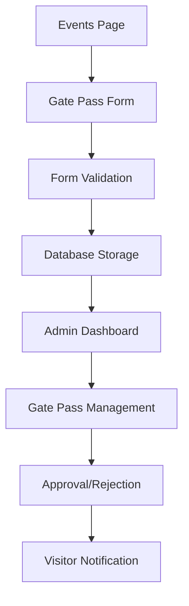

# Gate Pass Booking System - Product Requirements Document

## 1. Product Overview
A digital gate pass booking system integrated into the school's events page that allows visitors to pre-register their visit and obtain authorization for campus entry. The system streamlines visitor management by collecting essential information and providing administrators with a centralized dashboard to review and approve gate pass requests.

## 2. Core Features

### 2.1 User Roles
| Role | Registration Method | Core Permissions |
|------|---------------------|------------------|
| Visitor | Form submission on events page | Can submit gate pass requests, view submission status |
| Admin | Existing admin authentication | Can view, approve, reject, and manage all gate pass submissions |

### 2.2 Feature Module
Our gate pass booking system consists of the following main components:
1. **Gate Pass Request Form**: Visitor information collection, conditional fields based on designation, form validation and submission.
2. **Admin Gate Pass Dashboard**: Submission management, approval workflow, visitor details view.
3. **Database Management**: Secure data storage, submission tracking, status updates.

### 2.3 Page Details
| Page Name | Module Name | Feature description |
|-----------|-------------|---------------------|
| Events Page | Gate Pass Request Form | Collect visitor details (name, mobile, email, address, purpose), designation dropdown (parent, alumni, maintenance, other), conditional fields based on designation, form validation, submit functionality |
| Admin Dashboard | Gate Pass Management | View all submissions in tabular format, filter by status/date/designation, approve/reject requests, export submission data, search functionality |
| Admin Dashboard | Submission Details Modal | Display complete visitor information, conditional field data, approval status, action buttons (approve/reject) |

## 3. Core Process

**Visitor Flow:**
1. Visitor navigates to Events page
2. Fills out gate pass request form with required information
3. Selects designation from dropdown (parent, alumni, maintenance, other)
4. Completes conditional fields based on selected designation
5. Submits form and receives confirmation
6. Receives notification of approval/rejection status

**Admin Flow:**
1. Admin logs into admin dashboard
2. Navigates to Gate Pass module
3. Reviews submitted gate pass requests
4. Views detailed information for each submission
5. Approves or rejects requests with optional comments
6. Manages visitor access and generates reports



## 4. User Interface Design

### 4.1 Design Style
- **Primary Colors:** #1e40af (blue), #059669 (green for success)
- **Secondary Colors:** #6b7280 (gray), #dc2626 (red for errors)
- **Button Style:** Rounded corners with hover effects
- **Font:** Inter, 14px base size for forms, 16px for headings
- **Layout Style:** Card-based design with clean spacing
- **Icons:** Lucide React icons for consistency

### 4.2 Page Design Overview
| Page Name | Module Name | UI Elements |
|-----------|-------------|-------------|
| Events Page | Gate Pass Form | Clean form layout with grouped sections, dropdown with clear options, conditional field animations, prominent submit button, success/error toast notifications |
| Admin Dashboard | Gate Pass Table | Data table with sorting/filtering, status badges (pending/approved/rejected), action buttons, search bar, pagination controls |
| Admin Dashboard | Details Modal | Modal overlay with organized information display, clear action buttons, responsive design |

### 4.3 Responsiveness
Mobile-first responsive design with touch-friendly form elements and optimized table views for smaller screens.

## 5. Technical Specifications

### 5.1 Form Fields

**Basic Information (Required for all):**
- Name (text, required, max 100 characters)
- Mobile Number (tel, required, 10 digits)
- Email ID (email, required, valid email format)
- Address (textarea, required, max 500 characters)
- Purpose (text, required, max 200 characters)
- Designation (dropdown, required)

**Designation Options:**
- Parent
- Alumni
- Maintenance
- Other

**Conditional Fields:**

*If Parent selected:*
- Student Name (text, required, max 100 characters)
- Class (text, required, max 50 characters)
- Admission Number (text, required, max 20 characters)

*If Other selected:*
- Person Want to Meet (text, required, max 100 characters)

*If Maintenance selected:*
- Authorized Person Name/Reporting (text, required, max 100 characters)

### 5.2 Form Validation
- Real-time validation for all fields
- Email format validation
- Mobile number format validation (10 digits)
- Required field validation
- Character limit enforcement
- Conditional field validation based on designation

### 5.3 Database Schema

**Table: gate_pass_requests**
```sql
CREATE TABLE gate_pass_requests (
    id UUID PRIMARY KEY DEFAULT gen_random_uuid(),
    name VARCHAR(100) NOT NULL,
    mobile_number VARCHAR(10) NOT NULL,
    email VARCHAR(255) NOT NULL,
    address TEXT NOT NULL,
    purpose VARCHAR(200) NOT NULL,
    designation VARCHAR(20) NOT NULL CHECK (designation IN ('parent', 'alumni', 'maintenance', 'other')),
    student_name VARCHAR(100), -- for parent designation
    class VARCHAR(50), -- for parent designation
    admission_number VARCHAR(20), -- for parent designation
    person_to_meet VARCHAR(100), -- for other designation
    authorized_person VARCHAR(100), -- for maintenance designation
    status VARCHAR(20) DEFAULT 'pending' CHECK (status IN ('pending', 'approved', 'rejected')),
    admin_comments TEXT,
    approved_by UUID REFERENCES auth.users(id),
    created_at TIMESTAMP WITH TIME ZONE DEFAULT NOW(),
    updated_at TIMESTAMP WITH TIME ZONE DEFAULT NOW()
);

-- Indexes for performance
CREATE INDEX idx_gate_pass_status ON gate_pass_requests(status);
CREATE INDEX idx_gate_pass_created_at ON gate_pass_requests(created_at DESC);
CREATE INDEX idx_gate_pass_designation ON gate_pass_requests(designation);
```

### 5.4 Admin Interface Features
- **Dashboard Overview:** Total submissions, pending approvals, recent activity
- **Submission Management:** View all requests in paginated table
- **Filtering Options:** By status, designation, date range
- **Search Functionality:** Search by name, email, or mobile number
- **Bulk Actions:** Approve/reject multiple requests
- **Export Functionality:** Download submissions as CSV/PDF
- **Detailed View:** Modal with complete visitor information
- **Status Management:** Update request status with comments

### 5.5 Security & Permissions
- **Row Level Security (RLS):** Enabled for gate_pass_requests table
- **Public Access:** Allow INSERT for anonymous users (form submission)
- **Admin Access:** Full CRUD operations for authenticated admin users
- **Data Validation:** Server-side validation for all inputs
- **Rate Limiting:** Prevent spam submissions

### 5.6 Notifications
- **Email Notifications:** Send confirmation email upon submission
- **Status Updates:** Notify visitors of approval/rejection via email
- **Admin Alerts:** Real-time notifications for new submissions

## 6. Implementation Priority

**Phase 1 (Core Functionality):**
1. Database table creation and RLS policies
2. Gate pass request form on events page
3. Basic admin dashboard for viewing submissions

**Phase 2 (Enhanced Features):**
1. Advanced filtering and search in admin panel
2. Email notification system
3. Bulk actions and export functionality

**Phase 3 (Optimization):**
1. Real-time updates and notifications
2. Analytics and reporting features
3. Mobile app integration (if applicable)

## 7. Success Metrics
- **Form Completion Rate:** >85% of started forms should be completed
- **Admin Processing Time:** <24 hours average approval time
- **User Satisfaction:** >90% positive feedback on ease of use
- **System Reliability:** 99.9% uptime for form submissions