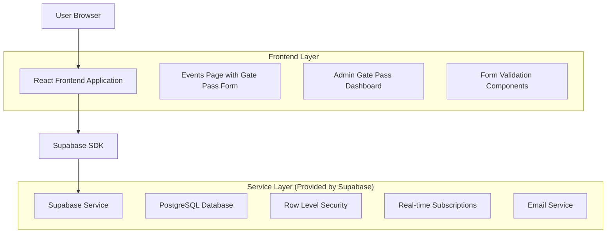
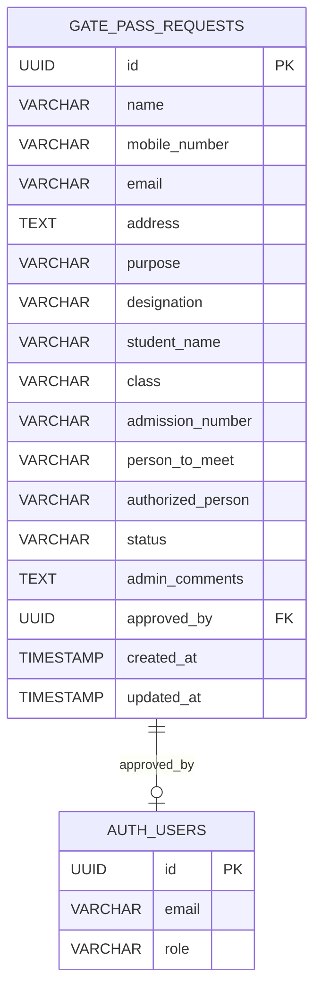

# Gate Pass Booking System - Technical Architecture Document

## 1. Architecture Design



## 2. Technology Description
- Frontend: React@18 + TypeScript + Tailwind CSS@3 + Vite
- Backend: Supabase (PostgreSQL + Auth + Real-time)
- Form Management: React Hook Form + Zod validation
- UI Components: Shadcn/ui + Lucide React icons
- State Management: React Query for server state

## 3. Route Definitions
| Route | Purpose |
|-------|----------|
| /events | Events page with integrated gate pass booking form |
| /admin/gate-pass | Admin dashboard for managing gate pass submissions |
| /admin/gate-pass/:id | Detailed view of specific gate pass submission |

## 4. API Definitions

### 4.1 Core API Endpoints

**Gate Pass Submission**
```
POST /rest/v1/gate_pass_requests
```

Request:
| Param Name | Param Type | isRequired | Description |
|------------|------------|------------|-------------|
| name | string | true | Visitor's full name |
| mobile_number | string | true | 10-digit mobile number |
| email | string | true | Valid email address |
| address | string | true | Visitor's address |
| purpose | string | true | Purpose of visit |
| designation | string | true | One of: parent, alumni, maintenance, other |
| student_name | string | conditional | Required if designation is 'parent' |
| class | string | conditional | Required if designation is 'parent' |
| admission_number | string | conditional | Required if designation is 'parent' |
| person_to_meet | string | conditional | Required if designation is 'other' |
| authorized_person | string | conditional | Required if designation is 'maintenance' |

Response:
| Param Name | Param Type | Description |
|------------|------------|-------------|
| id | UUID | Unique submission ID |
| status | string | Submission status (pending) |
| created_at | timestamp | Submission timestamp |

Example Request:
```json
{
  "name": "John Doe",
  "mobile_number": "9876543210",
  "email": "john.doe@example.com",
  "address": "123 Main Street, City",
  "purpose": "Parent-teacher meeting",
  "designation": "parent",
  "student_name": "Jane Doe",
  "class": "10th Grade",
  "admission_number": "ADM2024001"
}
```

**Get Gate Pass Submissions (Admin)**
```
GET /rest/v1/gate_pass_requests
```

Query Parameters:
| Param Name | Param Type | Description |
|------------|------------|-------------|
| status | string | Filter by status (pending, approved, rejected) |
| designation | string | Filter by designation type |
| limit | number | Number of records to return |
| offset | number | Pagination offset |
| order | string | Sort order (created_at.desc) |

**Update Gate Pass Status (Admin)**
```
PATCH /rest/v1/gate_pass_requests?id=eq.{id}
```

Request:
| Param Name | Param Type | isRequired | Description |
|------------|------------|------------|-------------|
| status | string | true | approved or rejected |
| admin_comments | string | false | Optional admin comments |
| approved_by | UUID | true | Admin user ID |

## 5. Data Model

### 5.1 Data Model Definition



### 5.2 Data Definition Language

**Gate Pass Requests Table**
```sql
-- Create gate_pass_requests table
CREATE TABLE gate_pass_requests (
    id UUID PRIMARY KEY DEFAULT gen_random_uuid(),
    name VARCHAR(100) NOT NULL,
    mobile_number VARCHAR(10) NOT NULL,
    email VARCHAR(255) NOT NULL,
    address TEXT NOT NULL,
    purpose VARCHAR(200) NOT NULL,
    designation VARCHAR(20) NOT NULL CHECK (designation IN ('parent', 'alumni', 'maintenance', 'other')),
    student_name VARCHAR(100),
    class VARCHAR(50),
    admission_number VARCHAR(20),
    person_to_meet VARCHAR(100),
    authorized_person VARCHAR(100),
    status VARCHAR(20) DEFAULT 'pending' CHECK (status IN ('pending', 'approved', 'rejected')),
    admin_comments TEXT,
    approved_by UUID REFERENCES auth.users(id),
    created_at TIMESTAMP WITH TIME ZONE DEFAULT NOW(),
    updated_at TIMESTAMP WITH TIME ZONE DEFAULT NOW()
);

-- Create indexes for performance
CREATE INDEX idx_gate_pass_status ON gate_pass_requests(status);
CREATE INDEX idx_gate_pass_created_at ON gate_pass_requests(created_at DESC);
CREATE INDEX idx_gate_pass_designation ON gate_pass_requests(designation);
CREATE INDEX idx_gate_pass_email ON gate_pass_requests(email);
CREATE INDEX idx_gate_pass_mobile ON gate_pass_requests(mobile_number);

-- Enable Row Level Security
ALTER TABLE gate_pass_requests ENABLE ROW LEVEL SECURITY;

-- Policy for public submissions (allow anyone to insert)
CREATE POLICY "Allow public gate pass submissions" ON gate_pass_requests
    FOR INSERT TO anon, authenticated
    WITH CHECK (true);

-- Policy for admin access (full access for authenticated admin users)
CREATE POLICY "Admin full access to gate pass requests" ON gate_pass_requests
    FOR ALL TO authenticated
    USING (auth.jwt() ->> 'role' = 'admin')
    WITH CHECK (auth.jwt() ->> 'role' = 'admin');

-- Policy for users to view their own submissions
CREATE POLICY "Users can view own submissions" ON gate_pass_requests
    FOR SELECT TO authenticated
    USING (email = auth.jwt() ->> 'email');

-- Function to update updated_at timestamp
CREATE OR REPLACE FUNCTION update_updated_at_column()
RETURNS TRIGGER AS $$
BEGIN
    NEW.updated_at = NOW();
    RETURN NEW;
END;
$$ language 'plpgsql';

-- Trigger to automatically update updated_at
CREATE TRIGGER update_gate_pass_requests_updated_at
    BEFORE UPDATE ON gate_pass_requests
    FOR EACH ROW
    EXECUTE FUNCTION update_updated_at_column();

-- Grant permissions
GRANT SELECT ON gate_pass_requests TO anon;
GRANT INSERT ON gate_pass_requests TO anon;
GRANT ALL PRIVILEGES ON gate_pass_requests TO authenticated;
```

## 6. Component Architecture

### 6.1 Frontend Components Structure

```
src/
├── components/
│   ├── gate-pass/
│   │   ├── GatePassForm.tsx          # Main form component
│   │   ├── ConditionalFields.tsx     # Dynamic fields based on designation
│   │   ├── FormValidation.ts         # Zod validation schemas
│   │   └── SubmissionSuccess.tsx     # Success confirmation
│   ├── admin/
│   │   ├── GatePassDashboard.tsx     # Admin dashboard
│   │   ├── GatePassTable.tsx         # Submissions table
│   │   ├── GatePassModal.tsx         # Detailed view modal
│   │   ├── StatusBadge.tsx           # Status indicator
│   │   └── BulkActions.tsx           # Bulk operations
│   └── ui/
│       ├── form/                     # Reusable form components
│       ├── table/                    # Table components
│       └── modal/                    # Modal components
├── hooks/
│   ├── useGatePassSubmission.ts      # Form submission logic
│   ├── useGatePassAdmin.ts           # Admin operations
│   └── useGatePassFilters.ts         # Filtering and search
├── types/
│   └── gate-pass.ts                  # TypeScript interfaces
└── lib/
    ├── validations/
    │   └── gate-pass-schema.ts        # Zod validation schemas
    └── utils/
        └── gate-pass-helpers.ts       # Utility functions
```

### 6.2 State Management

- **Form State:** React Hook Form for form management
- **Server State:** React Query for API calls and caching
- **UI State:** React useState for component-level state
- **Real-time Updates:** Supabase real-time subscriptions for admin dashboard

### 6.3 Validation Strategy

- **Client-side:** Zod schemas with React Hook Form integration
- **Server-side:** PostgreSQL constraints and RLS policies
- **Real-time:** Form validation on blur and change events
- **Conditional:** Dynamic validation based on designation selection

## 7. Security Implementation

### 7.1 Authentication & Authorization
- **Public Access:** Form submission without authentication
- **Admin Access:** Authenticated users with admin role
- **Row Level Security:** Database-level access control
- **JWT Validation:** Server-side token verification

### 7.2 Data Protection
- **Input Sanitization:** XSS prevention on all inputs
- **SQL Injection Prevention:** Parameterized queries via Supabase
- **Rate Limiting:** Prevent spam submissions
- **Data Encryption:** HTTPS for all communications

## 8. Performance Considerations

### 8.1 Database Optimization
- **Indexes:** Strategic indexing on frequently queried columns
- **Pagination:** Limit query results for large datasets
- **Connection Pooling:** Supabase handles connection management

### 8.2 Frontend Optimization
- **Code Splitting:** Lazy loading for admin components
- **Caching:** React Query for API response caching
- **Debouncing:** Search input debouncing
- **Virtual Scrolling:** For large submission lists

## 9. Deployment Strategy

### 9.1 Database Migration
1. Run SQL migration scripts in Supabase dashboard
2. Verify table creation and RLS policies
3. Test permissions with different user roles

### 9.2 Frontend Deployment
1. Build React application with new components
2. Deploy to existing hosting platform (Vercel/Netlify)
3. Update environment variables if needed

### 9.3 Testing Strategy
- **Unit Tests:** Component testing with Jest/React Testing Library
- **Integration Tests:** API endpoint testing
- **E2E Tests:** Form submission and admin workflow testing
- **Performance Tests:** Load testing for form submissions