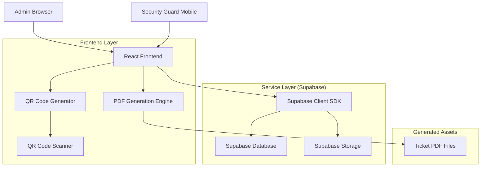
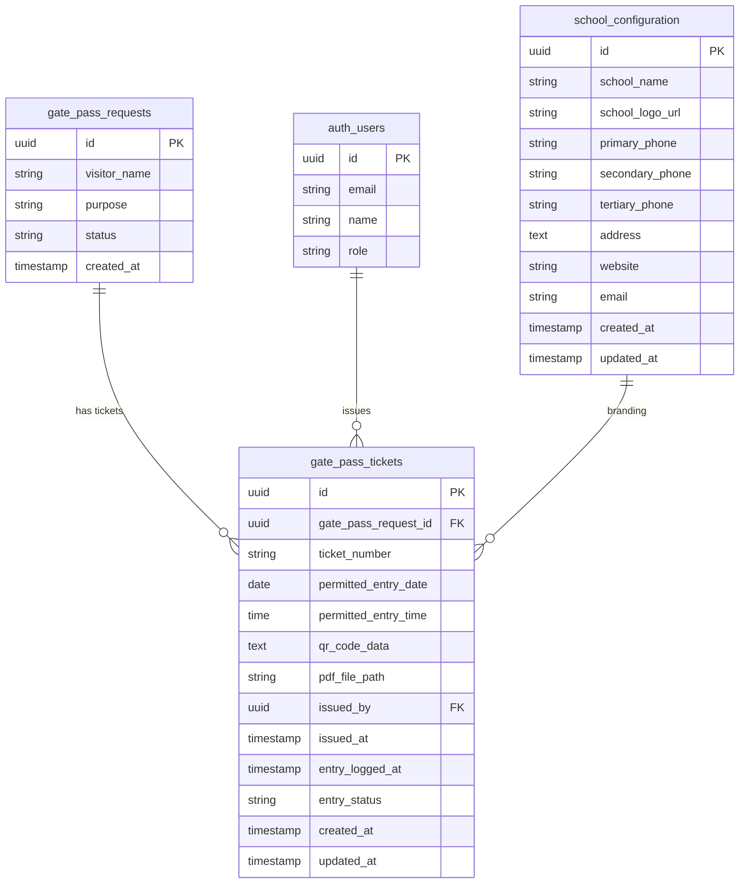

# Gate Pass Ticket System - Technical Architecture Document

## 1. Architecture Design



## 2. Technology Description

* **Frontend**: React\@18 + TypeScript + Tailwind CSS + Vite

* **PDF Generation**: jsPDF\@2.5.1 + html2canvas\@1.4.1

* **QR Code**: qrcode\@1.5.3 + react-qr-scanner\@1.0.0

* **Date Handling**: date-fns\@2.30.0

* **Backend**: Supabase (PostgreSQL + Storage + Auth)

* **File Storage**: Supabase Storage for PDF tickets

## 3. Route Definitions

| Route                       | Purpose                                          |
| --------------------------- | ------------------------------------------------ |
| /admin/gate-pass            | Main gate pass management dashboard              |
| /admin/gate-pass/tickets    | Ticket management and issuing interface          |
| /admin/gate-pass/config     | School configuration for ticket branding         |
| /security/scanner           | QR code scanner interface for security personnel |
| /security/verify/:ticketId  | Ticket verification and entry logging            |
| /tickets/download/:ticketId | Direct ticket download link                      |

## 4. API Definitions

### 4.1 Ticket Management API

**Issue Ticket**

```
POST /api/tickets/issue
```

Request:

| Param Name        | Param Type          | isRequired | Description                             |
| ----------------- | ------------------- | ---------- | --------------------------------------- |
| gatePassRequestId | string (UUID)       | true       | ID of approved gate pass request        |
| permittedDate     | string (YYYY-MM-DD) | true       | Date when visitor is permitted to enter |
| permittedTime     | string (HH:mm)      | true       | Time when visitor is permitted to enter |

Response:

| Param Name   | Param Type | Description                    |
| ------------ | ---------- | ------------------------------ |
| success      | boolean    | Operation status               |
| ticketId     | string     | Generated ticket ID            |
| ticketNumber | string     | Human-readable ticket number   |
| pdfUrl       | string     | Download URL for generated PDF |

Example:

```json
{
  "gatePassRequestId": "123e4567-e89b-12d3-a456-426614174000",
  "permittedDate": "2024-01-15",
  "permittedTime": "14:30"
}
```

**Verify QR Code**

```
POST /api/tickets/verify
```

Request:

| Param Name | Param Type | isRequired | Description                      |
| ---------- | ---------- | ---------- | -------------------------------- |
| qrData     | string     | true       | JSON string from scanned QR code |

Response:

| Param Name        | Param Type | Description                          |
| ----------------- | ---------- | ------------------------------------ |
| valid             | boolean    | Whether ticket is valid              |
| visitorName       | string     | Name of the visitor                  |
| purpose           | string     | Purpose of visit                     |
| permittedDateTime | string     | Permitted entry date and time        |
| status            | string     | Ticket status (pending/used/expired) |

**Log Entry**

```
POST /api/tickets/:ticketId/entry
```

Request:

| Param Name  | Param Type | isRequired | Description                    |
| ----------- | ---------- | ---------- | ------------------------------ |
| entryStatus | string     | true       | 'used' or 'denied'             |
| notes       | string     | false      | Additional notes from security |

### 4.2 School Configuration API

**Get Configuration**

```
GET /api/school/config
```

Response:

| Param Name     | Param Type | Description              |
| -------------- | ---------- | ------------------------ |
| schoolName     | string     | Name of the school       |
| logoUrl        | string     | URL to school logo       |
| primaryPhone   | string     | Primary contact number   |
| secondaryPhone | string     | Secondary contact number |
| tertiaryPhone  | string     | Tertiary contact number  |
| address        | string     | School address           |

**Update Configuration**

```
PUT /api/school/config
```

Request:

| Param Name     | Param Type | isRequired | Description            |
| -------------- | ---------- | ---------- | ---------------------- |
| schoolName     | string     | true       | School name            |
| logoFile       | File       | false      | Logo image file        |
| primaryPhone   | string     | false      | Primary phone number   |
| secondaryPhone | string     | false      | Secondary phone number |
| tertiaryPhone  | string     | false      | Tertiary phone number  |
| address        | string     | false      | School address         |

## 5. Data Model

### 5.1 Data Model Definition



### 5.2 Data Definition Language

**Gate Pass Tickets Table**

```sql
-- Create gate_pass_tickets table
CREATE TABLE gate_pass_tickets (
    id UUID PRIMARY KEY DEFAULT gen_random_uuid(),
    gate_pass_request_id UUID NOT NULL REFERENCES gate_pass_requests(id) ON DELETE CASCADE,
    ticket_number VARCHAR(20) UNIQUE NOT NULL,
    permitted_entry_date DATE NOT NULL,
    permitted_entry_time TIME NOT NULL,
    qr_code_data TEXT NOT NULL,
    pdf_file_path VARCHAR(500),
    issued_by UUID REFERENCES auth.users(id),
    issued_at TIMESTAMP WITH TIME ZONE DEFAULT NOW(),
    entry_logged_at TIMESTAMP WITH TIME ZONE,
    entry_status VARCHAR(20) DEFAULT 'pending' CHECK (entry_status IN ('pending', 'used', 'expired', 'cancelled')),
    created_at TIMESTAMP WITH TIME ZONE DEFAULT NOW(),
    updated_at TIMESTAMP WITH TIME ZONE DEFAULT NOW()
);

-- Create indexes for performance
CREATE INDEX idx_gate_pass_tickets_request_id ON gate_pass_tickets(gate_pass_request_id);
CREATE INDEX idx_gate_pass_tickets_ticket_number ON gate_pass_tickets(ticket_number);
CREATE INDEX idx_gate_pass_tickets_entry_date ON gate_pass_tickets(permitted_entry_date);
CREATE INDEX idx_gate_pass_tickets_status ON gate_pass_tickets(entry_status);

-- RLS Policies
ALTER TABLE gate_pass_tickets ENABLE ROW LEVEL SECURITY;

-- Allow authenticated users to read all tickets
CREATE POLICY "Allow authenticated users to read tickets" ON gate_pass_tickets
    FOR SELECT TO authenticated USING (true);

-- Allow authenticated users to insert tickets
CREATE POLICY "Allow authenticated users to create tickets" ON gate_pass_tickets
    FOR INSERT TO authenticated WITH CHECK (true);

-- Allow authenticated users to update tickets
CREATE POLICY "Allow authenticated users to update tickets" ON gate_pass_tickets
    FOR UPDATE TO authenticated USING (true);
```

**School Configuration Table**

```sql
-- Create school_configuration table
CREATE TABLE school_configuration (
    id UUID PRIMARY KEY DEFAULT gen_random_uuid(),
    school_name VARCHAR(200) NOT NULL,
    school_logo_url VARCHAR(500),
    primary_phone VARCHAR(20),
    secondary_phone VARCHAR(20),
    tertiary_phone VARCHAR(20),
    address TEXT,
    website VARCHAR(200),
    email VARCHAR(100),
    created_at TIMESTAMP WITH TIME ZONE DEFAULT NOW(),
    updated_at TIMESTAMP WITH TIME ZONE DEFAULT NOW()
);

-- RLS Policies
ALTER TABLE school_configuration ENABLE ROW LEVEL SECURITY;

-- Allow all authenticated users to read configuration
CREATE POLICY "Allow authenticated users to read config" ON school_configuration
    FOR SELECT TO authenticated USING (true);

-- Allow admin users to update configuration
CREATE POLICY "Allow admin users to update config" ON school_configuration
    FOR ALL TO authenticated USING (
        EXISTS (
            SELECT 1 FROM auth.users 
            WHERE auth.users.id = auth.uid() 
            AND auth.users.raw_user_meta_data->>'role' = 'admin'
        )
    );

-- Insert default configuration
INSERT INTO school_configuration (
    school_name, 
    primary_phone, 
    secondary_phone, 
    tertiary_phone,
    address
) VALUES (
    'Pottur School',
    '+91-XXXX-XXXX',
    '+91-YYYY-YYYY', 
    '+91-ZZZZ-ZZZZ',
    'Pottur Village, Andhra Pradesh, India'
);
```

**Ticket Number Generation Function**

```sql
-- Function to generate unique ticket numbers
CREATE OR REPLACE FUNCTION generate_ticket_number()
RETURNS TEXT AS $$
DECLARE
    new_number TEXT;
    counter INTEGER;
BEGIN
    -- Get current year and month
    SELECT 
        'TKT-' || 
        TO_CHAR(NOW(), 'YYYY') || '-' ||
        LPAD((EXTRACT(MONTH FROM NOW()))::TEXT, 2, '0') || '-' ||
        LPAD((COUNT(*) + 1)::TEXT, 4, '0')
    INTO new_number
    FROM gate_pass_tickets 
    WHERE DATE_TRUNC('month', created_at) = DATE_TRUNC('month', NOW());
    
    RETURN new_number;
END;
$$ LANGUAGE plpgsql;

-- Trigger to auto-generate ticket numbers
CREATE OR REPLACE FUNCTION set_ticket_number()
RETURNS TRIGGER AS $$
BEGIN
    IF NEW.ticket_number IS NULL THEN
        NEW.ticket_number := generate_ticket_number();
    END IF;
    RETURN NEW;
END;
$$ LANGUAGE plpgsql;

CREATE TRIGGER trigger_set_ticket_number
    BEFORE INSERT ON gate_pass_tickets
    FOR EACH ROW
    EXECUTE FUNCTION set_ticket_number();
```

## 6. Component Architecture

### 6.1 Frontend Components Structure

```
src/
├── components/
│   ├── admin/
│   │   ├── tickets/
│   │   │   ├── TicketIssueModal.tsx
│   │   │   ├── TicketPreview.tsx
│   │   │   ├── TicketsList.tsx
│   │   │   └── DateTimePicker.tsx
│   │   ├── config/
│   │   │   ├── SchoolConfigForm.tsx
│   │   │   └── LogoUpload.tsx
│   │   └── GatePassTable.tsx (enhanced)
│   ├── security/
│   │   ├── QRScanner.tsx
│   │   ├── TicketVerification.tsx
│   │   └── EntryLogger.tsx
│   └── shared/
│       ├── PDFGenerator.tsx
│       └── QRCodeGenerator.tsx
├── hooks/
│   ├── useTickets.ts
│   ├── useSchoolConfig.ts
│   └── useQRScanner.ts
├── utils/
│   ├── pdfGenerator.ts
│   ├── qrCodeUtils.ts
│   └── ticketValidation.ts
└── types/
    ├── ticket.types.ts
    └── school.types.ts
```

### 6.2 Key Hooks and Utilities

**useTickets Hook**

```typescript
interface UseTicketsReturn {
  tickets: Ticket[];
  isLoading: boolean;
  error: string | null;
  issueTicket: (data: IssueTicketData) => Promise<Ticket>;
  verifyTicket: (qrData: string) => Promise<VerificationResult>;
  logEntry: (ticketId: string, status: EntryStatus) => Promise<void>;
  downloadTicket: (ticketId: string) => Promise<void>;
}
```

**PDF Generation Utility**

```typescript
interface TicketPDFOptions {
  visitorName: string;
  purpose: string;
  permittedDate: string;
  permittedTime: string;
  ticketNumber: string;
  qrCodeData: string;
  schoolConfig: SchoolConfiguration;
}

function generateTicketPDF(options: TicketPDFOptions): Promise<Blob>;
```

## 7. Security Implementation

### 7.1 QR Code Security

* QR codes include cryptographic hash for tamper detection

* Timestamp validation prevents replay attacks

* Ticket expiration based on permitted date

* Rate limiting on QR code verification

### 7.2 File Storage Security

* PDF files stored in private Supabase buckets

* Signed URLs for temporary access

* File access logging and monitoring

* Automatic cleanup of expired tickets

### 7.3 Database Security

* Row Level Security (RLS) policies

* Role-based access control

* Input validation and sanitization

* Audit logging for all ticket operations

## 8. Performance Optimizations

### 8.1 PDF Generation

* Client-side generation to reduce server load

* Template caching for faster rendering

* Optimized image compression for logos

* Lazy loading of PDF generation library

### 8.2 Database Performance

* Strategic indexing on frequently queried columns

* Pagination for ticket lists

* Connection pooling optimization

* Query optimization for complex joins

### 8.3 Frontend Performance

* Component lazy loading

* Image optimization for school logos

* Efficient state management

* Debounced search and filtering

## 9. Deployment Considerations

### 9.1 Environment Variables

```env
VITE_SUPABASE_URL=your_supabase_url
VITE_SUPABASE_ANON_KEY=your_supabase_anon_key
VITE_SCHOOL_DEFAULT_LOGO=default_logo_url
VITE_TICKET_EXPIRY_HOURS=24
```

### 9.2 Build Configuration

* PDF generation libraries bundled separately

* QR scanner optimized for mobile devices

* Progressive Web App (PWA) support for security interface

* Offline capability for basic ticket verification

### 9.3 Monitoring and Analytics

* Ticket generation success rates

* QR code scan frequency

* Entry logging statistics

* Performance metrics for PDF generation

