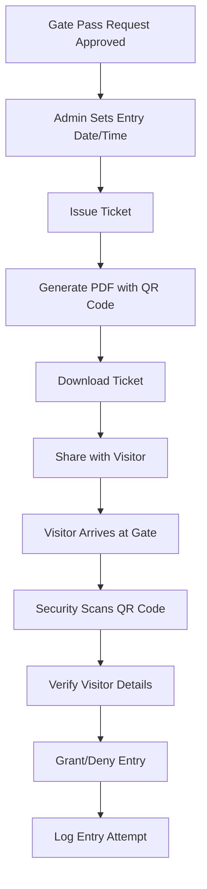

# Gate Pass Ticket Issuing System - Technical Requirements Document

## 1. Product Overview
A comprehensive ticket issuing system for the Gate Pass Management module that allows administrators to generate professional PDF tickets with QR codes for approved gate pass requests. The system enables setting permitted entry dates/times and generates downloadable tickets with school branding and visitor verification data.

## 2. Core Features

### 2.1 User Roles
| Role | Registration Method | Core Permissions |
|------|---------------------|------------------|
| Admin | Admin dashboard access | Can issue tickets, set entry times, download tickets |
| Security Guard | QR scanner access | Can scan and verify QR codes |

### 2.2 Feature Module
Our Gate Pass Ticket System consists of the following main components:
1. **Ticket Issuing Interface**: Date/time picker, issue ticket button, ticket preview
2. **PDF Ticket Generator**: Professional layout with QR code, school branding, visitor details
3. **School Configuration Panel**: Logo upload, school details, contact information management
4. **QR Code Verification**: Scanner interface for security personnel
5. **Ticket Management Dashboard**: View issued tickets, reprint options, ticket status tracking

### 2.3 Page Details
| Page Name | Module Name | Feature description |
|-----------|-------------|---------------------|
| **Ticket Issuing Interface** | Date/Time Selector | Select permitted entry date and time with calendar widget and time picker |
| **Ticket Issuing Interface** | Issue Ticket Button | Generate and download PDF ticket with one-click functionality |
| **Ticket Issuing Interface** | Ticket Preview | Real-time preview of ticket design before generation |
| **PDF Ticket Generator** | Layout Engine | Portrait-oriented professional design with school branding |
| **PDF Ticket Generator** | QR Code Generator | Central QR code containing visitor data and verification info |
| **PDF Ticket Generator** | Branding Integration | School logo, name, and contact details embedded in ticket |
| **School Configuration** | Logo Management | Upload and manage school logo for ticket branding |
| **School Configuration** | Contact Details | Manage school name, phone numbers, and address information |
| **QR Verification** | Scanner Interface | Mobile-friendly QR code scanner for security personnel |
| **QR Verification** | Visitor Validation | Display visitor details when QR code is scanned |
| **Ticket Management** | Issued Tickets List | View all issued tickets with search and filter options |
| **Ticket Management** | Ticket Status | Track ticket usage and entry status |

## 3. Core Process

### Admin Flow
1. Admin reviews approved gate pass request
2. Admin sets permitted entry date and time
3. Admin clicks "Issue Ticket" button
4. System generates PDF ticket with QR code
5. Admin downloads and shares ticket with visitor

### Security Verification Flow
1. Visitor presents QR code at gate
2. Security guard scans QR code
3. System displays visitor details and permitted time
4. Security guard verifies identity and grants/denies entry
5. System logs entry attempt



## 4. User Interface Design

### 4.1 Design Style
- **Primary Colors**: School brand colors (configurable), Professional blue (#2563eb) as default
- **Secondary Colors**: Gray tones (#64748b, #f1f5f9) for backgrounds and borders
- **Button Style**: Rounded corners (8px), solid fills with hover effects
- **Font**: Inter or system fonts, 14px base size, 16px for headings
- **Layout Style**: Card-based design with clean spacing, responsive grid layout
- **Icons**: Lucide React icons for consistency, QR code and calendar icons prominent

### 4.2 Page Design Overview
| Page Name | Module Name | UI Elements |
|-----------|-------------|-------------|
| **Ticket Issuing Interface** | Date/Time Selector | Calendar widget with time picker, modern date input with validation |
| **Ticket Issuing Interface** | Issue Button | Primary blue button with ticket icon, loading state with spinner |
| **PDF Ticket** | Layout Design | Portrait A4 format, white background, professional typography |
| **PDF Ticket** | QR Code Section | Centered 150x150px QR code with border, clear scanning instructions |
| **PDF Ticket** | Header Section | School logo (left), school name and contact (right), balanced layout |
| **School Config** | Logo Upload | Drag-and-drop area with preview, file format validation |
| **QR Scanner** | Camera Interface | Full-screen camera view with scanning overlay and instructions |

### 4.3 Responsiveness
Desktop-first design with mobile-adaptive layouts. Touch-optimized QR scanner interface for mobile devices. Responsive ticket preview that scales appropriately on different screen sizes.

## 5. Database Schema Design

### 5.1 New Tables

#### gate_pass_tickets
```sql
CREATE TABLE gate_pass_tickets (
    id UUID PRIMARY KEY DEFAULT gen_random_uuid(),
    gate_pass_request_id UUID NOT NULL REFERENCES gate_pass_requests(id) ON DELETE CASCADE,
    ticket_number VARCHAR(20) UNIQUE NOT NULL,
    permitted_entry_date DATE NOT NULL,
    permitted_entry_time TIME NOT NULL,
    qr_code_data TEXT NOT NULL,
    pdf_file_path VARCHAR(500),
    issued_by UUID REFERENCES auth.users(id),
    issued_at TIMESTAMP WITH TIME ZONE DEFAULT NOW(),
    entry_logged_at TIMESTAMP WITH TIME ZONE,
    entry_status VARCHAR(20) DEFAULT 'pending' CHECK (entry_status IN ('pending', 'used', 'expired', 'cancelled')),
    created_at TIMESTAMP WITH TIME ZONE DEFAULT NOW(),
    updated_at TIMESTAMP WITH TIME ZONE DEFAULT NOW()
);

CREATE INDEX idx_gate_pass_tickets_request_id ON gate_pass_tickets(gate_pass_request_id);
CREATE INDEX idx_gate_pass_tickets_ticket_number ON gate_pass_tickets(ticket_number);
CREATE INDEX idx_gate_pass_tickets_entry_date ON gate_pass_tickets(permitted_entry_date);
```

#### school_configuration
```sql
CREATE TABLE school_configuration (
    id UUID PRIMARY KEY DEFAULT gen_random_uuid(),
    school_name VARCHAR(200) NOT NULL,
    school_logo_url VARCHAR(500),
    primary_phone VARCHAR(20),
    secondary_phone VARCHAR(20),
    tertiary_phone VARCHAR(20),
    address TEXT,
    website VARCHAR(200),
    email VARCHAR(100),
    created_at TIMESTAMP WITH TIME ZONE DEFAULT NOW(),
    updated_at TIMESTAMP WITH TIME ZONE DEFAULT NOW()
);

-- Insert default configuration
INSERT INTO school_configuration (school_name, primary_phone, secondary_phone, tertiary_phone)
VALUES ('Pottur School', '+91-XXXX-XXXX', '+91-YYYY-YYYY', '+91-ZZZZ-ZZZZ');
```

### 5.2 QR Code Data Structure
```json
{
  "ticketId": "TKT-2024-001234",
  "visitorName": "John Doe",
  "purpose": "Parent-Teacher Meeting",
  "permittedDate": "2024-01-15",
  "permittedTime": "14:30",
  "gatePassId": "uuid-string",
  "issueDate": "2024-01-10T10:30:00Z",
  "validUntil": "2024-01-15T23:59:59Z"
}
```

## 6. Technical Implementation

### 6.1 Technology Stack
- **Frontend**: React 18 + TypeScript + Tailwind CSS
- **PDF Generation**: jsPDF + html2canvas for client-side PDF generation
- **QR Code**: qrcode.js for QR code generation
- **Date/Time**: date-fns for date manipulation
- **File Storage**: Supabase Storage for PDF files
- **Database**: PostgreSQL via Supabase

### 6.2 Key Dependencies
```json
{
  "jspdf": "^2.5.1",
  "html2canvas": "^1.4.1",
  "qrcode": "^1.5.3",
  "react-qr-scanner": "^1.0.0",
  "date-fns": "^2.30.0"
}
```

### 6.3 API Endpoints

#### Ticket Management
```typescript
// Issue new ticket
POST /api/tickets/issue
Body: {
  gatePassRequestId: string,
  permittedDate: string,
  permittedTime: string
}

// Get ticket details
GET /api/tickets/:ticketId

// Verify QR code
POST /api/tickets/verify
Body: { qrData: string }

// Log entry
POST /api/tickets/:ticketId/entry
Body: { entryStatus: 'used' | 'denied' }
```

#### School Configuration
```typescript
// Get school config
GET /api/school/config

// Update school config
PUT /api/school/config
Body: {
  schoolName: string,
  logoUrl?: string,
  phones: string[],
  address?: string
}
```

### 6.4 PDF Ticket Template Structure
```html
<div class="ticket-container" style="width: 210mm; height: 297mm; padding: 20mm;">
  <!-- Header with logo and school info -->
  <div class="header">
    
    <div class="school-info">
      <h1>{schoolName}</h1>
      <p>{phones}</p>
    </div>
  </div>
  
  <!-- Ticket title -->
  <div class="title">
    <h2>GATE PASS TICKET</h2>
    <p>Ticket #: {ticketNumber}</p>
  </div>
  
  <!-- Visitor details -->
  <div class="visitor-info">
    <p><strong>Visitor:</strong> {visitorName}</p>
    <p><strong>Purpose:</strong> {purpose}</p>
    <p><strong>Permitted Date:</strong> {permittedDate}</p>
    <p><strong>Permitted Time:</strong> {permittedTime}</p>
  </div>
  
  <!-- QR Code -->
  <div class="qr-section">
    
    <p>Scan QR code for verification</p>
  </div>
  
  <!-- Footer -->
  <div class="footer">
    <p>This ticket is valid only for the specified date and time.</p>
    <p>Please carry valid ID proof for verification.</p>
  </div>
</div>
```

### 6.5 Implementation Phases

**Phase 1: Database Setup**
- Create new tables and relationships
- Set up RLS policies
- Create initial school configuration

**Phase 2: Backend API**
- Implement ticket issuing logic
- QR code generation and verification
- File storage integration

**Phase 3: Frontend Components**
- Ticket issuing interface
- PDF generation and download
- School configuration management

**Phase 4: QR Scanner**
- Mobile-friendly scanner interface
- Verification and logging system
- Security guard dashboard

**Phase 5: Testing & Optimization**
- End-to-end testing
- Performance optimization
- Security validation

## 7. Security Considerations

- QR codes include timestamp validation to prevent replay attacks
- Ticket numbers are unique and non-sequential
- Entry logging for audit trails
- File access controls for PDF storage
- Rate limiting on ticket generation
- Input validation and sanitization

## 8. Performance Requirements

- PDF generation should complete within 3 seconds
- QR code scanning response time under 1 second
- Support for concurrent ticket generation
- Efficient database indexing for quick lookups
- Optimized file storage and retrieval