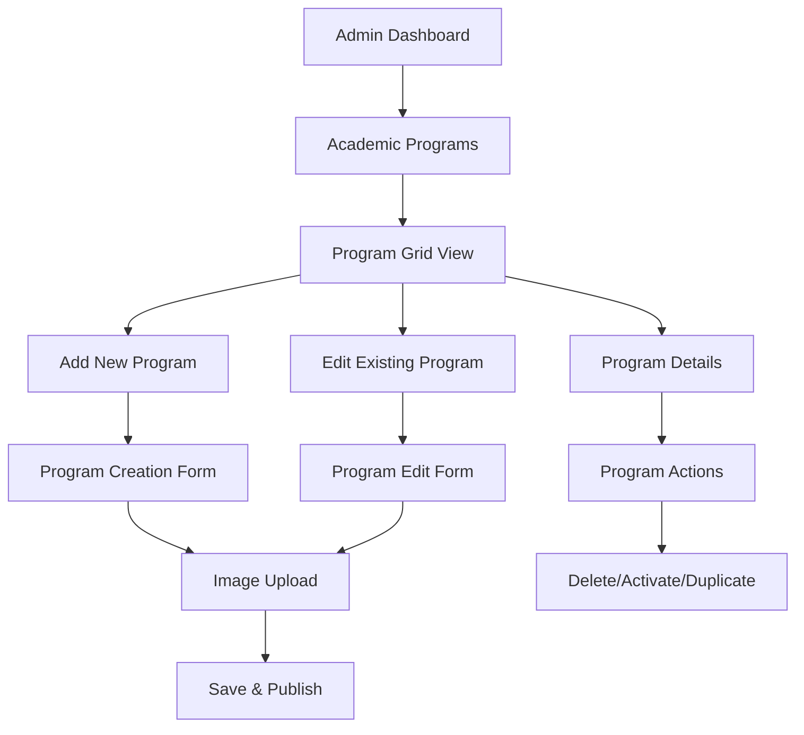

## 1. Product Overview

The Academic Manager module redesign transforms the current preview-only interface into a comprehensive administrative management system with full CRUD capabilities for academic program management. This enhancement enables administrators to create, edit, delete, and manage academic programs with integrated image upload functionality and synchronized database-storage operations.

* The redesigned module addresses the need for manual administrative control over academic content, replacing static displays with dynamic management capabilities.

* Target users include school administrators and content managers who require efficient tools for maintaining academic program information and visual assets.

## 2. Core Features

### 2.1 User Roles

| Role            | Registration Method                        | Core Permissions                                                         |
| --------------- | ------------------------------------------ | ------------------------------------------------------------------------ |
| Administrator   | Admin role assignment in user\_roles table | Full CRUD access to academic programs, image management, content editing |
| Content Manager | Admin-granted access with limited scope    | Create and edit academic programs, upload images                         |

### 2.2 Feature Module

Our Academic Manager redesign consists of the following main pages:

1. **Academic Programs Dashboard**: Program overview grid, quick actions toolbar, search and filter capabilities
2. **Program Creation Page**: New program form, image upload interface, validation feedback
3. **Program Edit Page**: Existing program modification, image replacement, content management
4. **Program Details View**: Comprehensive program information, preview mode, action buttons
5. **Settings Page**: System configuration, storage management, user permissions

### 2.3 Page Details

| Page Name                   | Module Name           | Feature description                                                                            |
| --------------------------- | --------------------- | ---------------------------------------------------------------------------------------------- |
| Academic Programs Dashboard | Program Grid          | Display all academic programs in card layout with thumbnails, titles, and quick action buttons |
| Academic Programs Dashboard | Action Toolbar        | Add New Program button, bulk operations, search bar, filter dropdown                           |
| Academic Programs Dashboard | Status Indicators     | Show program status (active/inactive), last modified date, content completeness                |
| Program Creation Page       | Program Form          | Input fields for program title, short description, full description, category selection        |
| Program Creation Page       | Image Upload          | Drag-and-drop image upload, preview functionality, format validation, size optimization        |
| Program Creation Page       | Validation System     | Real-time form validation, error messaging, required field indicators                          |
| Program Edit Page           | Content Editor        | Rich text editor for descriptions, formatting tools, preview mode                              |
| Program Edit Page           | Image Management      | Replace existing images, crop/resize tools, multiple image support                             |
| Program Edit Page           | Version Control       | Save draft, publish changes, revert to previous version                                        |
| Program Details View        | Information Display   | Complete program details, formatted descriptions, image gallery                                |
| Program Details View        | Action Panel          | Edit, delete, duplicate, activate/deactivate buttons                                           |
| Settings Page               | Storage Configuration | Manage storage buckets, file size limits, allowed formats                                      |
| Settings Page               | User Management       | Assign roles, manage permissions, audit logs                                                   |

## 3. Core Process

**Administrator Flow:**

1. Login to admin dashboard
2. Navigate to Academic Programs section
3. View existing programs in grid layout
4. Create new program using "Add New" button
5. Fill program details and upload images
6. Save and publish program
7. Edit existing programs as needed
8. Manage program status and visibility

**Content Manager Flow:**

1. Access assigned academic programs
2. Edit program content and descriptions
3. Upload and manage program images
4. Submit changes for review
5. Monitor content status and feedback

## 4. User Interface Design

### 4.1 Design Style

* **Primary Colors**: Blue (#3B82F6) for primary actions, Gray (#6B7280) for secondary elements

* **Secondary Colors**: Green (#10B981) for success states, Red (#EF4444) for destructive actions

* **Button Style**: Rounded corners (8px), subtle shadows, hover animations

* **Typography**: Inter font family, 16px base size, clear hierarchy with 24px/20px/16px/14px scales

* **Layout Style**: Card-based design with consistent spacing (16px/24px/32px), top navigation with breadcrumbs

* **Icons**: Heroicons style, consistent 20px/24px sizes, outlined style for secondary actions

### 4.2 Page Design Overview

| Page Name                   | Module Name       | UI Elements                                                                             |
| --------------------------- | ----------------- | --------------------------------------------------------------------------------------- |
| Academic Programs Dashboard | Program Grid      | 3-column responsive grid, card shadows, hover effects, thumbnail images (200x150px)     |
| Academic Programs Dashboard | Action Toolbar    | Sticky header, primary blue "Add New" button, search input with icon, filter dropdown   |
| Program Creation Page       | Form Layout       | Two-column layout, left form fields, right image preview, progress indicator            |
| Program Creation Page       | Image Upload      | Dashed border drop zone, drag-over highlighting, upload progress bar, format validation |
| Program Edit Page           | Content Editor    | Split view with live preview, toolbar with formatting options, auto-save indicators     |
| Program Details View        | Information Panel | Clean typography hierarchy, image gallery with lightbox, action buttons in fixed footer |

### 4.3 Responsiveness

Desktop-first approach with mobile-adaptive breakpoints at 768px and 1024px. Touch-optimized interactions for mobile devices including larger tap targets (44px minimum), swipe gestures for navigation, and optimized image upload flow for mobile cameras.

## 5. Technical Requirements

### 5.1 Performance Standards

* Page load time under 2 seconds

* Image upload processing under 5 seconds

* Real-time validation response under 200ms

* Smooth animations at 60fps

### 5.2 Security Requirements

* Role-based access control (RBAC)

* Input sanitization and validation

* Secure file upload with type checking

* Audit logging for all administrative actions

### 5.3 Accessibility Standards

* WCAG 2.1 AA compliance

* Keyboard navigation support

* Screen reader compatibility

* High contrast mode support

