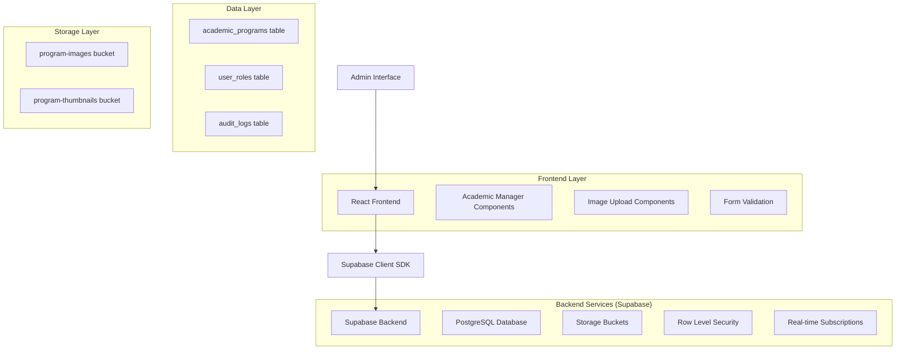
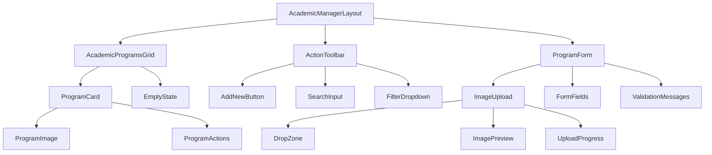
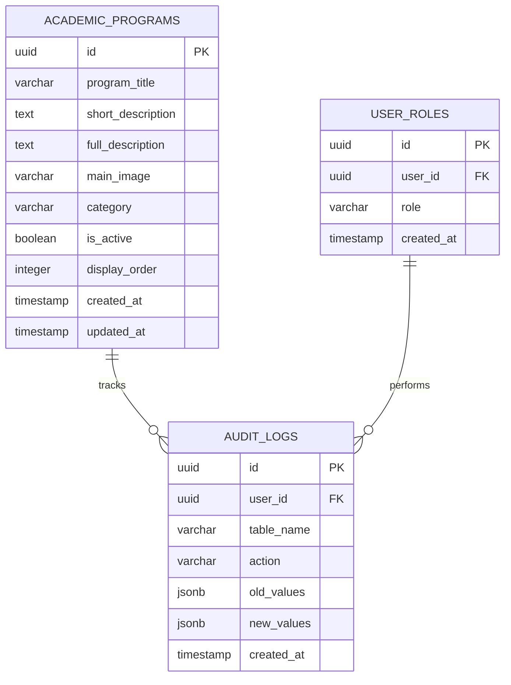

## 1. Architecture Design



## 2. Technology Description

* Frontend: React\@18 + TypeScript + TailwindCSS\@3 + Vite + React Hook Form + React Query

* Backend: Supabase (PostgreSQL + Storage + Auth + Real-time)

* UI Components: Headless UI + Heroicons + React DnD

* Image Processing: Browser-native Canvas API + File API

* State Management: React Query + Zustand for local state

## 3. Route Definitions

| Route                     | Purpose                                         |
| ------------------------- | ----------------------------------------------- |
| /admin/academics          | Main academic programs dashboard with grid view |
| /admin/academics/new      | Create new academic program form                |
| /admin/academics/:id/edit | Edit existing academic program                  |
| /admin/academics/:id      | View academic program details                   |
| /admin/academics/settings | Academic module configuration and settings      |
| /admin/academics/bulk     | Bulk operations interface for multiple programs |

## 4. API Definitions

### 4.1 Core API

**Academic Programs Management**

```typescript
// Get all academic programs
GET /rest/v1/academic_programs
Query Parameters:
- select: string (columns to select)
- order: string (sorting)
- limit: number (pagination)
- offset: number (pagination)

Response:
{
  "data": [
    {
      "id": "uuid",
      "program_title": "string",
      "short_description": "string",
      "full_description": "string",
      "main_image": "string",
      "category": "string",
      "is_active": "boolean",
      "created_at": "timestamp",
      "updated_at": "timestamp"
    }
  ]
}
```

```typescript
// Create new academic program
POST /rest/v1/academic_programs
Request Body:
{
  "program_title": "string",
  "short_description": "string",
  "full_description": "string",
  "main_image": "string",
  "category": "string",
  "is_active": "boolean"
}

Response:
{
  "data": {
    "id": "uuid",
    "program_title": "string",
    "created_at": "timestamp"
  }
}
```

```typescript
// Update academic program
PATCH /rest/v1/academic_programs?id=eq.{id}
Request Body:
{
  "program_title": "string",
  "short_description": "string",
  "full_description": "string",
  "main_image": "string",
  "updated_at": "timestamp"
}
```

```typescript
// Delete academic program
DELETE /rest/v1/academic_programs?id=eq.{id}
```

**File Upload API**

```typescript
// Upload program image
POST /storage/v1/object/program-images/{filename}
Headers:
- Content-Type: multipart/form-data
- Authorization: Bearer {token}

Request Body: FormData with file

Response:
{
  "Key": "program-images/{filename}",
  "Id": "uuid"
}
```

### 4.2 TypeScript Interfaces

```typescript
interface AcademicProgram {
  id: string;
  program_title: string;
  short_description: string;
  full_description: string;
  main_image: string | null;
  category: 'pre-school' | 'primary' | 'up-school' | 'high-school' | 'higher-secondary' | 'competitive';
  is_active: boolean;
  display_order: number;
  created_at: string;
  updated_at: string;
}

interface ProgramFormData {
  program_title: string;
  short_description: string;
  full_description: string;
  category: string;
  is_active: boolean;
  image_file?: File;
}

interface ImageUploadResponse {
  url: string;
  path: string;
  size: number;
}

interface ValidationError {
  field: string;
  message: string;
  code: string;
}
```

## 5. Component Architecture



## 6. Data Model

### 6.1 Data Model Definition



### 6.2 Data Definition Language

**Enhanced Academic Programs Table**

```sql
-- Drop existing table if exists
DROP TABLE IF EXISTS academic_programs CASCADE;

-- Create enhanced academic_programs table
CREATE TABLE academic_programs (
    id UUID PRIMARY KEY DEFAULT gen_random_uuid(),
    program_title VARCHAR(255) NOT NULL,
    short_description TEXT NOT NULL,
    full_description TEXT NOT NULL,
    main_image VARCHAR(500),
    category VARCHAR(50) NOT NULL CHECK (category IN ('pre-school', 'primary', 'up-school', 'high-school', 'higher-secondary', 'competitive')),
    is_active BOOLEAN DEFAULT true,
    display_order INTEGER DEFAULT 0,
    created_at TIMESTAMP WITH TIME ZONE DEFAULT NOW(),
    updated_at TIMESTAMP WITH TIME ZONE DEFAULT NOW()
);

-- Create indexes
CREATE INDEX idx_academic_programs_category ON academic_programs(category);
CREATE INDEX idx_academic_programs_active ON academic_programs(is_active);
CREATE INDEX idx_academic_programs_order ON academic_programs(display_order);
CREATE INDEX idx_academic_programs_updated ON academic_programs(updated_at DESC);

-- Create audit logs table
CREATE TABLE audit_logs (
    id UUID PRIMARY KEY DEFAULT gen_random_uuid(),
    user_id UUID REFERENCES auth.users(id),
    table_name VARCHAR(100) NOT NULL,
    action VARCHAR(20) NOT NULL CHECK (action IN ('INSERT', 'UPDATE', 'DELETE')),
    record_id UUID,
    old_values JSONB,
    new_values JSONB,
    created_at TIMESTAMP WITH TIME ZONE DEFAULT NOW()
);

-- Create indexes for audit logs
CREATE INDEX idx_audit_logs_user_id ON audit_logs(user_id);
CREATE INDEX idx_audit_logs_table_action ON audit_logs(table_name, action);
CREATE INDEX idx_audit_logs_created_at ON audit_logs(created_at DESC);

-- Create storage buckets
INSERT INTO storage.buckets (id, name, public) 
VALUES 
    ('program-images', 'program-images', true),
    ('program-thumbnails', 'program-thumbnails', true)
ON CONFLICT (id) DO NOTHING;

-- RLS Policies for academic_programs
ALTER TABLE academic_programs ENABLE ROW LEVEL SECURITY;

-- Allow public read access
CREATE POLICY "Allow public read access" ON academic_programs
    FOR SELECT USING (true);

-- Allow authenticated users with admin role to manage
CREATE POLICY "Allow admin full access" ON academic_programs
    FOR ALL USING (
        auth.uid() IN (
            SELECT user_id FROM user_roles WHERE role = 'admin'
        )
    );

-- RLS Policies for storage
CREATE POLICY "Allow public read access" ON storage.objects
    FOR SELECT USING (bucket_id IN ('program-images', 'program-thumbnails'));

CREATE POLICY "Allow admin upload" ON storage.objects
    FOR INSERT WITH CHECK (
        bucket_id IN ('program-images', 'program-thumbnails') AND
        auth.uid() IN (
            SELECT user_id FROM user_roles WHERE role = 'admin'
        )
    );

CREATE POLICY "Allow admin update" ON storage.objects
    FOR UPDATE USING (
        bucket_id IN ('program-images', 'program-thumbnails') AND
        auth.uid() IN (
            SELECT user_id FROM user_roles WHERE role = 'admin'
        )
    );

CREATE POLICY "Allow admin delete" ON storage.objects
    FOR DELETE USING (
        bucket_id IN ('program-images', 'program-thumbnails') AND
        auth.uid() IN (
            SELECT user_id FROM user_roles WHERE role = 'admin'
        )
    );

-- Insert initial academic programs data
INSERT INTO academic_programs (program_title, short_description, full_description, category, display_order) VALUES
('Pre-School Education', 'Early childhood development and learning foundation', 'Our pre-school program focuses on holistic development of children aged 3-5 years, providing a nurturing environment that promotes cognitive, social, emotional, and physical growth through play-based learning and structured activities.', 'pre-school', 1),
('Primary School', 'Building strong academic fundamentals', 'Primary education from grades 1-5 emphasizes core subjects including Mathematics, Science, English, and Social Studies. Our curriculum is designed to develop critical thinking skills, creativity, and a love for learning through interactive teaching methods.', 'primary', 2),
('Upper Primary School', 'Advanced learning and skill development', 'Grades 6-8 focus on preparing students for higher secondary education with enhanced curriculum in Mathematics, Science, Languages, and Social Sciences. Students develop research skills, analytical thinking, and subject specialization.', 'up-school', 3),
('High School Education', 'Comprehensive secondary education', 'High school program for grades 9-10 provides comprehensive education following state board curriculum. Students prepare for board examinations while developing leadership skills, career awareness, and academic excellence.', 'high-school', 4),
('Higher Secondary', 'Specialized streams for career preparation', 'Grades 11-12 offer specialized streams in Science, Commerce, and Arts. Students receive focused preparation for competitive examinations and higher education with experienced faculty and modern facilities.', 'higher-secondary', 5),
('Competitive Coaching', 'Excellence in competitive examinations', 'Specialized coaching for JEE, NEET, UPSC, and other competitive examinations. Expert faculty, comprehensive study materials, and regular assessments ensure students achieve their career goals in engineering, medical, and civil services.', 'competitive', 6);

-- Create trigger for updated_at
CREATE OR REPLACE FUNCTION update_updated_at_column()
RETURNS TRIGGER AS $$
BEGIN
    NEW.updated_at = NOW();
    RETURN NEW;
END;
$$ language 'plpgsql';

CREATE TRIGGER update_academic_programs_updated_at
    BEFORE UPDATE ON academic_programs
    FOR EACH ROW
    EXECUTE FUNCTION update_updated_at_column();

-- Grant permissions
GRANT SELECT ON academic_programs TO anon;
GRANT ALL PRIVILEGES ON academic_programs TO authenticated;
GRANT ALL PRIVILEGES ON audit_logs TO authenticated;
```

## 7. Implementation Roadmap

### Phase 1: Database and Storage Setup (Week 1)

* Execute enhanced database migration

* Configure storage buckets and policies

* Set up audit logging system

* Test RLS policies and permissions

### Phase 2: Core CRUD Components (Week 2)

* Implement AcademicProgramsGrid component

* Create ProgramForm with validation

* Build ImageUpload component

* Add basic CRUD operations

### Phase 3: Advanced Features (Week 3)

* Implement search and filtering

* Add bulk operations

* Create audit trail interface

* Optimize image handling and thumbnails

### Phase 4: UI/UX Polish (Week 4)

* Responsive design implementation

* Animation and interaction improvements

* Accessibility compliance

* Performance optimization

### Phase 5: Testing and Deployment (Week 5)

* Unit and integration testing

* User acceptance testing

* Security audit

* Production deployment

