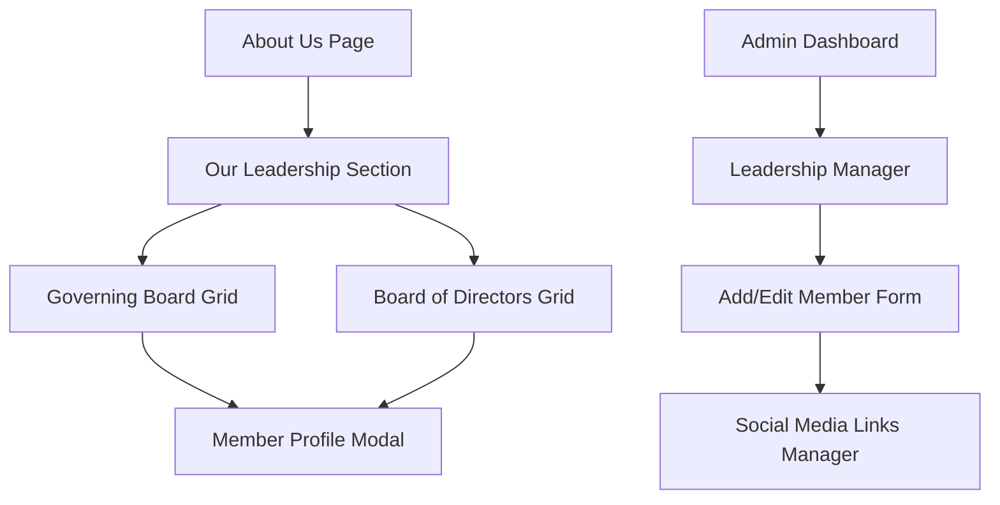

## 1. Product Overview
Implement a comprehensive Director Board section on the About Us page featuring professional member profiles with detailed modal views and full admin management capabilities.
- Solve the need for showcasing school leadership with professional presentation and easy content management for administrators.
- Target educational institutions requiring transparent leadership display with efficient backend management system.

## 2. Core Features

### 2.1 User Roles
| Role | Registration Method | Core Permissions |
|------|---------------------|------------------|
| Public User | No registration required | Can view leadership profiles and access detailed member information |
| Admin User | Existing admin authentication | Can perform full CRUD operations on board members and manage all leadership content |

### 2.2 Feature Module
Our Director Board feature consists of the following main pages:
1. **About Us Page Enhancement**: leadership section display, member profile cards, modal popup functionality.
2. **Admin Leadership Manager**: member management interface, CRUD operations, form handling.
3. **Member Profile Modal**: detailed member information, contact details, social media integration.

### 2.3 Page Details
| Page Name | Module Name | Feature description |
|-----------|-------------|---------------------|
| About Us Page | Our Leadership Section | Display two distinct subsections (Governing Board and Board of Directors) with professional member profile cards featuring hover effects and click interactions |
| About Us Page | Member Profile Cards | Show member photo, name, and designation in responsive grid layout with subtle animations and professional styling |
| About Us Page | Profile Detail Modal | Open detailed popup on card click displaying full member information including bio, contact details, and social media links with proper modal overlay |
| Admin Dashboard | Leadership Manager | Provide comprehensive CRUD interface for managing all board members with intuitive navigation and bulk operations |
| Admin Dashboard | Add/Edit Member Form | Handle member data input with fields for name, designation, photo upload, board type selection, rich text bio editor, contact information, and dynamic social media links |
| Admin Dashboard | Social Media Manager | Enable dynamic addition/removal of social media links with platform dropdown (LinkedIn, Twitter/X, Facebook) and URL validation |

## 3. Core Process
**Public User Flow:**
Users navigate to About Us page → View leadership section with Governing Board and Board of Directors → Click on member cards → View detailed profile in modal popup → Access contact information and social media links → Close modal to return to main page.

**Admin User Flow:**
Admin logs into dashboard → Navigate to About Us Page Management → Access Leadership Manager → Create new member or edit existing → Fill form with member details → Add social media links dynamically → Upload member photo → Save changes → View updated frontend display.

## 4. User Interface Design
### 4.1 Design Style
- Primary colors: Professional blue (#1e40af) and clean white (#ffffff)
- Secondary colors: Light gray (#f8fafc) for backgrounds, dark gray (#374151) for text
- Button style: Rounded corners with subtle shadows and hover transitions
- Font: Inter or similar modern sans-serif, 16px base size for readability
- Layout style: Card-based design with clean spacing and responsive grid system
- Icons: Professional outline style for social media and interface elements

### 4.2 Page Design Overview
| Page Name | Module Name | UI Elements |
|-----------|-------------|-------------|
| About Us Page | Our Leadership Section | Clean section header with professional typography, responsive grid layout (3-4 columns desktop, 2 mobile), subtle section dividers |
| About Us Page | Member Profile Cards | Professional card design with rounded corners, subtle shadows, member photo with overlay effects, clean typography hierarchy, hover animations with scale and shadow effects |
| About Us Page | Profile Detail Modal | Centered modal with backdrop blur, professional header with member photo and details, organized content sections, social media icon buttons, smooth open/close animations |
| Admin Dashboard | Leadership Manager | Clean table layout with action buttons, search and filter functionality, responsive design with mobile-friendly controls, consistent with existing admin styling |
| Admin Dashboard | Add/Edit Member Form | Organized form sections with clear labels, file upload with preview, rich text editor integration, dynamic social media fields with add/remove buttons, validation feedback |

### 4.3 Responsiveness
Desktop-first approach with mobile-adaptive design ensuring touch-friendly interactions, optimized card layouts for different screen sizes, and accessible modal functionality across all devices.