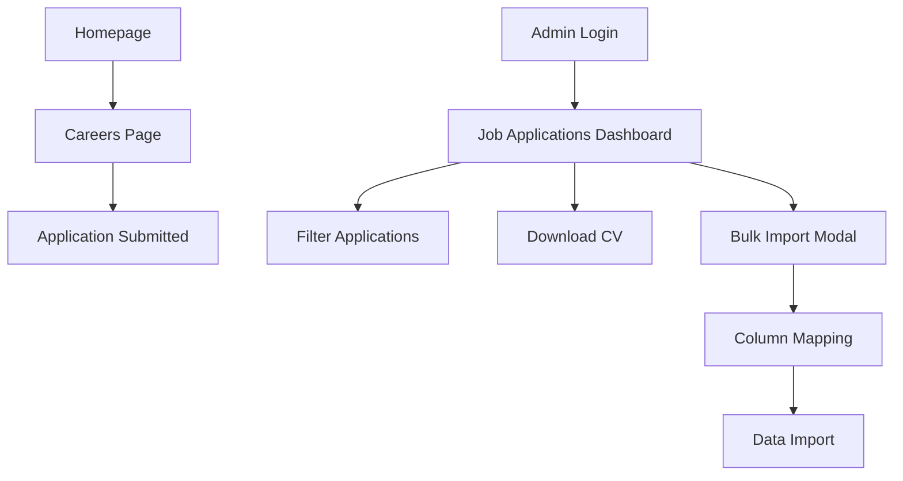

# Job Application Module - Product Requirements Document

## 1. Product Overview
A comprehensive job application system for Pottur School Connect that enables job seekers to submit applications online and provides administrators with tools to manage, filter, and process applications efficiently.

The module addresses the need for streamlined recruitment processes by digitizing application submissions and providing robust administrative capabilities for application management.

## 2. Core Features

### 2.1 User Roles
| Role | Registration Method | Core Permissions |
|------|---------------------|------------------|
| Job Applicant | No registration required | Can submit job applications, upload CV/resume |
| Admin User | Existing admin authentication | Can view, filter, download applications, bulk import data |

### 2.2 Feature Module
Our job application module consists of the following main pages:
1. **Homepage Enhancement**: "Join Our Team" section with call-to-action button
2. **Careers Page**: Comprehensive job application form with conditional fields
3. **Admin Job Applications**: Administrative interface for managing applications

### 2.3 Page Details
| Page Name | Module Name | Feature description |
|-----------|-------------|---------------------|
| Homepage | Join Our Team Section | Display inspiring content about school culture, "Apply Now" button linking to careers page |
| Careers Page | Job Application Form | Collect applicant details including name, designation preference, contact info, location, CV upload with conditional fields for teaching subjects and other specifications |
| Admin Dashboard | Job Applications Management | Display applications in sortable table, advanced filtering system, bulk import functionality, CV download capabilities |
| Admin Dashboard | Application Filters | Filter by name, designation, subject, mobile, email, district with combinable search criteria |
| Admin Dashboard | Bulk Import Modal | Upload CSV/Excel files, map columns to database fields, import applicant data in bulk |

## 3. Core Process

**Job Applicant Flow:**
1. User visits homepage and sees "Join Our Team" section
2. Clicks "Apply Now" button to navigate to careers page
3. Fills out application form with personal and professional details
4. Selects designation and provides conditional information (subject for teaching, specification for other roles)
5. Uploads CV/resume in PDF or DOC format
6. Submits application and receives confirmation

**Admin Management Flow:**
1. Admin logs into dashboard and navigates to "Job Applications" section
2. Views all applications in tabular format with key details
3. Uses filtering system to search for specific applicants
4. Downloads CV files for review
5. Optionally imports bulk applicant data via CSV/Excel upload

## 4. User Interface Design

### 4.1 Design Style
- **Primary Colors**: School brand colors (blue #1e40af, green #059669)
- **Secondary Colors**: Gray scale for text and backgrounds (#f8fafc, #64748b)
- **Button Style**: Rounded corners with hover effects, consistent with existing design
- **Font**: Inter or system fonts, 16px base size for accessibility
- **Layout Style**: Card-based design with clean spacing, mobile-first responsive approach
- **Icons**: Lucide React icons for consistency with existing interface

### 4.2 Page Design Overview
| Page Name | Module Name | UI Elements |
|-----------|-------------|-------------|
| Homepage | Join Our Team Section | Hero-style section with background image, centered text content, prominent CTA button with blue background and white text |
| Careers Page | Application Form | Clean form layout with grouped sections, conditional field animations, file upload dropzone, progress indicators, mobile-optimized input fields |
| Admin Dashboard | Applications Table | Data table with sortable columns, pagination, action buttons, responsive design with horizontal scroll on mobile |
| Admin Dashboard | Filter Panel | Collapsible filter section with input fields and dropdowns, clear/reset functionality, real-time search results |
| Admin Dashboard | Import Modal | Modal overlay with drag-drop file upload, column mapping interface, progress bar for import status |

### 4.3 Responsiveness
Mobile-first responsive design with breakpoints at 768px (tablet) and 1024px (desktop). Touch-optimized form inputs and buttons for mobile devices. Table views adapt to card layouts on smaller screens.