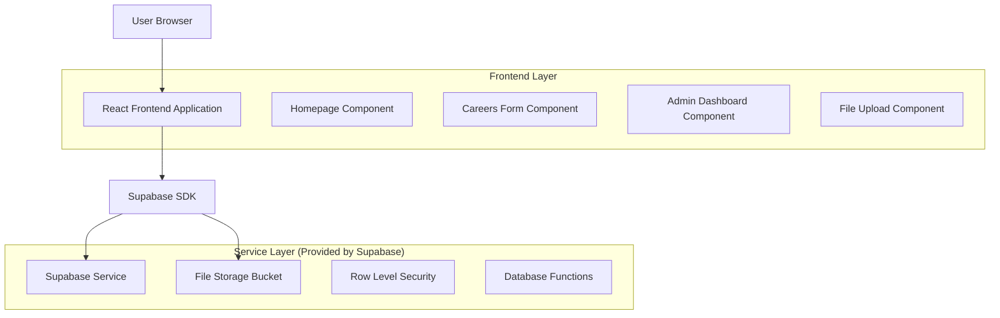
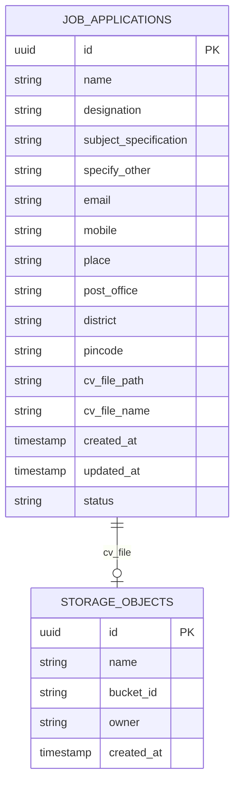

# Job Application Module - Technical Architecture Document

## 1. Architecture Design



## 2. Technology Description

- Frontend: React@18 + TypeScript + Tailwind CSS + Vite
- Backend: Supabase (PostgreSQL + Authentication + Storage)
- File Upload: Supabase Storage with RLS policies
- Form Handling: React Hook Form + Zod validation
- UI Components: Shadcn/ui + Lucide React icons

## 3. Route Definitions

| Route | Purpose |
|-------|---------|
| / | Homepage with "Join Our Team" section |
| /careers | Job application form page |
| /admin/job-applications | Admin dashboard for managing applications |
| /admin/job-applications/import | Bulk import modal/page |

## 4. API Definitions

### 4.1 Core API

**Job Application Submission**
```
POST /rest/v1/job_applications
```

Request:
| Param Name | Param Type | isRequired | Description |
|------------|------------|------------|-------------|
| name | string | true | Applicant's full name |
| designation | string | true | Desired position (Teaching Staff, Admin Staff, etc.) |
| subject_specification | string | false | Subject for teaching positions |
| specify_other | string | false | Details for "Other" designation |
| email | string | true | Email address |
| mobile | string | true | Mobile phone number |
| place | string | true | Current place of residence |
| post_office | string | true | Post office |
| district | string | true | District |
| pincode | string | true | Postal code |
| cv_file_path | string | false | Path to uploaded CV file |

Response:
| Param Name | Param Type | Description |
|------------|------------|-------------|
| id | uuid | Application ID |
| created_at | timestamp | Submission timestamp |
| status | string | Application status |

**File Upload**
```
POST /storage/v1/object/job-applications-cvs/{filename}
```

Request: Multipart form data with CV file
Response: File path and public URL

**Admin - Fetch Applications**
```
GET /rest/v1/job_applications
```

Query Parameters:
| Param Name | Param Type | Description |
|------------|------------|-------------|
| name | string | Filter by applicant name |
| designation | string | Filter by designation |
| subject_specification | string | Filter by subject |
| email | string | Filter by email |
| mobile | string | Filter by mobile number |
| district | string | Filter by district |
| limit | integer | Pagination limit |
| offset | integer | Pagination offset |

**Bulk Import**
```
POST /rest/v1/rpc/bulk_import_applications
```

Request:
| Param Name | Param Type | Description |
|------------|------------|-------------|
| applications_data | json[] | Array of application objects |
| column_mapping | json | Mapping of CSV columns to database fields |

## 5. Data Model

### 5.1 Data Model Definition



### 5.2 Data Definition Language

**Job Applications Table**
```sql
-- Create job applications table
CREATE TABLE job_applications (
    id UUID PRIMARY KEY DEFAULT gen_random_uuid(),
    name VARCHAR(255) NOT NULL,
    designation VARCHAR(100) NOT NULL CHECK (designation IN ('Teaching Staff', 'Admin Staff', 'Office Staff', 'Security Staff', 'Other')),
    subject_specification VARCHAR(255),
    specify_other VARCHAR(255),
    email VARCHAR(255) NOT NULL,
    mobile VARCHAR(20) NOT NULL,
    place VARCHAR(255) NOT NULL,
    post_office VARCHAR(255) NOT NULL,
    district VARCHAR(255) NOT NULL,
    pincode VARCHAR(10) NOT NULL,
    cv_file_path TEXT,
    cv_file_name VARCHAR(255),
    status VARCHAR(50) DEFAULT 'pending' CHECK (status IN ('pending', 'reviewed', 'shortlisted', 'rejected')),
    created_at TIMESTAMP WITH TIME ZONE DEFAULT NOW(),
    updated_at TIMESTAMP WITH TIME ZONE DEFAULT NOW()
);

-- Create indexes for better query performance
CREATE INDEX idx_job_applications_designation ON job_applications(designation);
CREATE INDEX idx_job_applications_district ON job_applications(district);
CREATE INDEX idx_job_applications_created_at ON job_applications(created_at DESC);
CREATE INDEX idx_job_applications_email ON job_applications(email);
CREATE INDEX idx_job_applications_mobile ON job_applications(mobile);

-- Create storage bucket for CV files
INSERT INTO storage.buckets (id, name, public) VALUES ('job-applications-cvs', 'job-applications-cvs', false);

-- RLS Policies
ALTER TABLE job_applications ENABLE ROW LEVEL SECURITY;

-- Allow public insert for job applications
CREATE POLICY "Allow public insert" ON job_applications
    FOR INSERT TO anon
    WITH CHECK (true);

-- Allow authenticated users (admins) to view all applications
CREATE POLICY "Allow admin read" ON job_applications
    FOR SELECT TO authenticated
    USING (true);

-- Allow authenticated users (admins) to update applications
CREATE POLICY "Allow admin update" ON job_applications
    FOR UPDATE TO authenticated
    USING (true);

-- Storage policies for CV files
CREATE POLICY "Allow public upload" ON storage.objects
    FOR INSERT TO anon
    WITH CHECK (bucket_id = 'job-applications-cvs');

CREATE POLICY "Allow admin download" ON storage.objects
    FOR SELECT TO authenticated
    USING (bucket_id = 'job-applications-cvs');

-- Database function for bulk import
CREATE OR REPLACE FUNCTION bulk_import_applications(
    applications_data jsonb[],
    column_mapping jsonb
)
RETURNS TABLE(imported_count integer, error_count integer, errors text[])
LANGUAGE plpgsql
SECURITY DEFINER
AS $$
DECLARE
    app_data jsonb;
    imported integer := 0;
    errors_arr text[] := '{}';
    error_count integer := 0;
BEGIN
    FOREACH app_data IN ARRAY applications_data
    LOOP
        BEGIN
            INSERT INTO job_applications (
                name, designation, subject_specification, specify_other,
                email, mobile, place, post_office, district, pincode
            ) VALUES (
                app_data->>(column_mapping->>'name'),
                app_data->>(column_mapping->>'designation'),
                app_data->>(column_mapping->>'subject_specification'),
                app_data->>(column_mapping->>'specify_other'),
                app_data->>(column_mapping->>'email'),
                app_data->>(column_mapping->>'mobile'),
                app_data->>(column_mapping->>'place'),
                app_data->>(column_mapping->>'post_office'),
                app_data->>(column_mapping->>'district'),
                app_data->>(column_mapping->>'pincode')
            );
            imported := imported + 1;
        EXCEPTION WHEN OTHERS THEN
            error_count := error_count + 1;
            errors_arr := array_append(errors_arr, SQLERRM);
        END;
    END LOOP;
    
    RETURN QUERY SELECT imported, error_count, errors_arr;
END;
$$;

-- Grant execute permission to authenticated users
GRANT EXECUTE ON FUNCTION bulk_import_applications TO authenticated;
```

## 6. Component Architecture

### 6.1 Frontend Components Structure

```
src/
├── components/
│   ├── careers/
│   │   ├── JoinOurTeamSection.tsx
│   │   ├── JobApplicationForm.tsx
│   │   ├── ConditionalFields.tsx
│   │   └── FileUpload.tsx
│   ├── admin/
│   │   ├── JobApplicationsTable.tsx
│   │   ├── ApplicationFilters.tsx
│   │   ├── BulkImportModal.tsx
│   │   └── ColumnMapper.tsx
│   └── ui/
│       ├── form-components.tsx
│       └── data-table.tsx
├── pages/
│   ├── Careers.tsx
│   └── admin/
│       └── JobApplications.tsx
├── hooks/
│   ├── useJobApplications.ts
│   ├── useFileUpload.ts
│   └── useBulkImport.ts
├── types/
│   └── job-application.ts
└── lib/
    ├── supabase.ts
    └── validations/
        └── job-application.ts
```

### 6.2 Security Considerations

- **File Upload Security**: Validate file types (.pdf, .doc, .docx), file size limits (5MB max)
- **Input Validation**: Client-side and server-side validation using Zod schemas
- **RLS Policies**: Restrict admin access to authenticated users only
- **CORS Configuration**: Proper CORS setup for file uploads
- **Rate Limiting**: Implement rate limiting for form submissions
- **Data Sanitization**: Sanitize all user inputs to prevent XSS attacks

### 6.3 Performance Optimizations

- **Pagination**: Implement server-side pagination for large datasets
- **Lazy Loading**: Lazy load admin components
- **File Compression**: Compress uploaded files when possible
- **Caching**: Cache filter results and application counts
- **Debounced Search**: Debounce filter inputs to reduce API calls
- **Virtual Scrolling**: For large application lists in admin interface